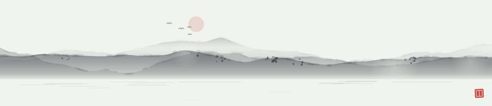
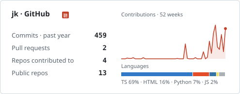
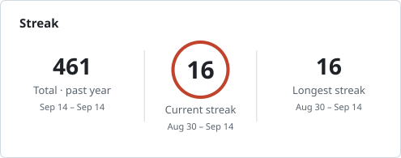

<!-- The painting, the cards and the caption are regenerated every morning by .github/workflows/daily.yml -->

  <picture>
    <source media="(prefers-color-scheme: dark)" srcset="assets/ink-today-dark.png">
    
  </picture>

<!-- CAPTION:START -->今日山色 · 2026-09-11 · a new ink landscape every morning, seeded by the date &nbsp;·&nbsp; 「香汗薄衫凉，凉衫薄汗香。」 苏轼<!-- CAPTION:END -->

### Hi, I'm jk.

Software engineer. I work on billing and growth infrastructure — the plumbing that turns usage into revenue — and on making engineering teams faster with AI agents.

<table>
  <tr><td><b>Languages</b></td><td>Go · Python · TypeScript · Rust</td></tr>
  <tr><td><b>Ground</b></td><td>Kubernetes · Postgres · Stripe · Cloudflare</td></tr>
  <tr><td><b>Thinking about</b></td><td>agentic engineering, the economics of AI products</td></tr>
  <tr><td><b>Explore</b></td><td><a href="https://tingfeng-world.pages.dev/">听风的小世界</a> — wander a little archipelago of writing, projects and games</td></tr>
</table>

  <picture>
    <source media="(prefers-color-scheme: dark)" srcset="assets/stats-dark.svg">
    
  </picture>
  <picture>
    <source media="(prefers-color-scheme: dark)" srcset="assets/streak-dark.svg">
    
  </picture>

  <picture>
    <source media="(prefers-color-scheme: dark)" srcset="https://raw.githubusercontent.com/Defiabell/Defiabell/output/github-contribution-grid-snake-dark.svg">
    
  </picture>

About the painting

Drawn from scratch every morning by a GitHub Action, with the date as the random seed — value-noise ridgelines, layered washes, one red sun. Same day, same picture; tomorrow, a new one. It is the same painter that draws the header of <a href="https://defiabell.github.io">听风闲语</a>.

